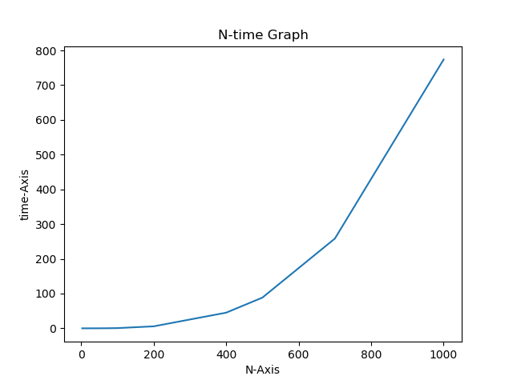

# STEP Class2

## 宿題1

行列のサイズ(N)と実行時間(time)の関係グラフ



計算量はO(N^3)

## 宿題2
現実の大規模なデータベースでは、ハッシュテーブルではなく木構造が使われることが多い。その理由を考えよ。
1. ハッシュテーブル用のメモリの確保をしなくていいのでメモリの節約になる。
2. ソートをする時やデータ間の値の比較をする際に便利である。例えば、ヒープ木は最大値、最小値の取得が一発でできる。
3. 適切なハッシュ関数を考えなくていいので楽。
4. 木構造の方が安定的にO(logN)で探索、追加、削除ができる。ハッシュテーブルはハッシュ関数やデータによっては衝突が多くなってしまい、結果的に計算量が悪くなるかもしれない。


## 宿題3
1. 辞書と双方向リンクリストを使ってキャッシュを実装する。
2. 辞書はURLをkeyとして保持し、valueとして対応する双方向リンクリストのノードを保持し、このリンクリストのデータには、<URL, webページ>が保存される。
3. キャッシュに<URL, webページ>のペアを追加するaccess_pageメソッドは、  
    URLにアクセスした時、辞書を探索して、  
    ```
    if URLが辞書に存在しない:
        if 今のキャッシュの容量は最大サイズに達していない:
            双方向リンクリストの最後にwebページの値を保存
        else:
            双方向リンクリストの最初の値を削除し、最後にwebページの値を保存
    else:
        prev.next = curr.nextで今の場所の値を削除し、最後にwebページの値を保存
    ```
4. キャッシュのget_pagesでは、双方向リンクリストを後ろから順に追っていけば良い。

つまり、以下のコードのような機能を、双方向リンクリストと辞書を使って実装する。
```
class Cache:
  def __init__(self, n):
    self.size = n
    self.cache_dict = {}

  def access_page(self, url, contents):
    if self.cache_dict.get(url) == None:
      if len(self.cache_dict) < self.size:
        self.cache_dict[url] = contents
      else:
        self.cache_dict.pop(list(self.cache_dict.keys())[0])
        self.cache_dict[url] = contents
    else:
      self.cache_dict.pop(url)
      self.cache_dict[url] = contents

  def get_pages(self):
    return list(self.cache_dict.keys())[::-1]
```