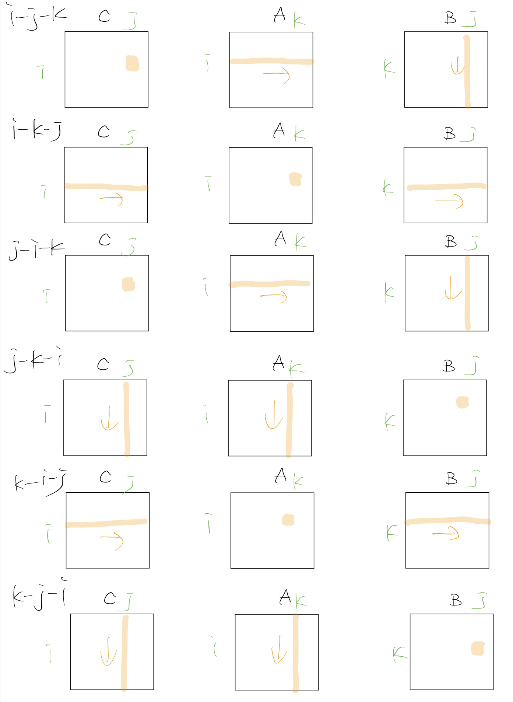

# STEP Class7

## 宿題1
行列積のループ順序としては6種類の組合せがある。この6種類を実行速度が速いと思う方から順に並べてください。実際に実験してその予想が正しいかどうか確かめてください。

i-j-k, i-k-j, j-i-k, j-k-i, k-i-j, k-j-i

### 予想

上記のメモリアクセスの図を見ると、i-k-j, k-i-j > i-j-k, j-i-k > j-k-i, k-j-i を容易に予測できる。

### 実行結果
N = 1000で測りました。
| 順番  | 一回目(sec) | 二回目(sec)  | 三回目(sec)  | 平均(sec)  |
| ----- | ----------- | ------------ | ------------ | ---------- |
| i-j-k |    6.837101 |     7.311932 |     7.453345 |  7.200792666666666 |
| i-k-j |    3.293644 |     3.249041 |     4.563154 | 3.7019463333333333 |
| j-i-k |    4.862235 |     4.820462 |     5.883447 |  5.188714666666667 |
| j-k-i |   10.679509 |    12.547264 |    13.112388 | 12.113053666666667 |
| k-i-j |    3.093653 |     3.274317 |     3.986977 | 3.4516489999999997 |
| k-j-i |   10.420620 |    10.166737 |    10.277342 |          10.288233 |

実際の速さの順番は、k-i-j > i-k-j > j-i-k > i-j-k > k-j-i > j-k-i という結果になった。

### 考察 
i-k-j, k-i-jのペア、i-j-k, j-i-kのペアとj-k-i, k-j-iのペアの速度はあまり変わらないと思われたが、実際のところ速度に差があった。一番内側のループは更新の回数が一番多い部分になるので、そこのアクセス方法が連続的であれば、相対的に早いのであろう。また、観察してみた結果、偶然かもしれないが、一番内側のループが行列A,B,Cにアクセスする速度は、行列Cにアクセスするのが一番早いようだ。

## 宿題2
C/C++/Java/Goで行列積を書くと、i-k-jループのほうがi-j-kループよりもずっと速かった。でも、実はPythonで書くと、ループ順序を入れ替えても速度差はほとんどない。ここまでの説明をふまえて、その理由を考えてください。

### 理由
まず、一つ目の理由として、インタプリタは構文木を最適化する過程がないので、コンパイラより実行が遅い。ループを交換した際に速度が速くなるのは、連続的なメモリアクセスが可能になったからである。だが、pythonのようなインタプリタ言語では、字句解析の時に、i+1をiに1足したものとして、都度足し算を計算しながらプログラムを走らせているので、連続的なメモリアクセスをしているつもりでも、実はそれが検知されず、速度が遅いままなのではないかと推測した。

## 宿題3 TSP Challenge!!
https://github.com/Hisokalalala/google-step-tsp
このリポジトリで作業しました。詳細はリンク先のリポジトリにまとめます。
